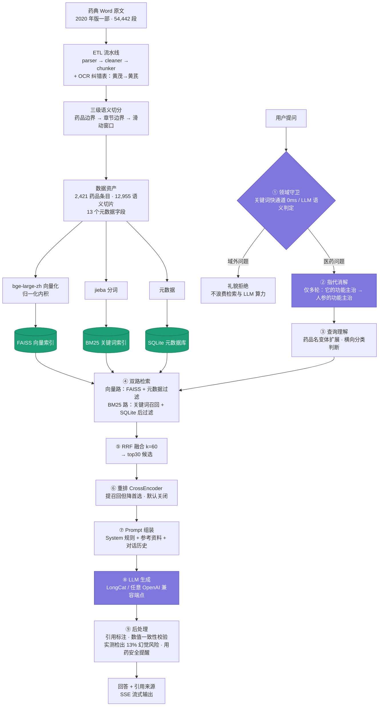
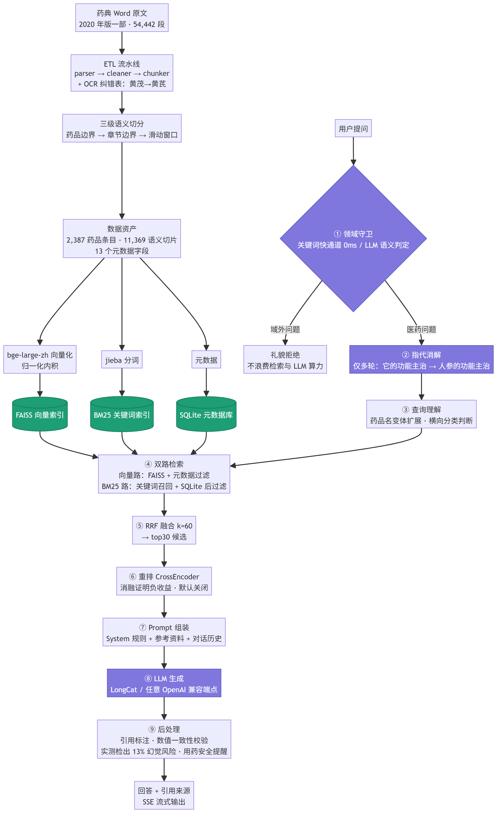
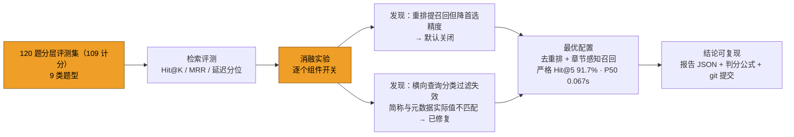
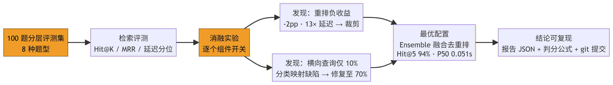

# 中华药典智能问答系统

基于《中国药典》2020 年版一部构建的端到端 RAG（检索增强生成）系统，覆盖从原始文档解析到智能问答的完整流水线。

系统从 54,442 段原始 Word 文档中提取 **2,421 个药品条目**、生成 **12,955 个语义切片**，通过向量检索 + BM25 + RRF 融合 + 元数据过滤 + 章节感知召回的混合检索架构，实现 **严格口径 Hit@5 = 88.42%（手撕版）/ 87.37%（LangChain 标准版）** 的检索准确率（[口径与结果详见评估小节](#评估结果)），并集成大模型（LongCat / 任意 OpenAI 兼容端点）提供专业问答服务。项目包含**手写实现**与 **LangChain 标准版**两套完全独立引擎，可并行运行、对比评估。

---

## 系统架构

离线索引只跑一次，产出三套数据资产；在线问答每次提问按 **① → ⑨** 顺序执行：



图例：紫色 = LLM 出场点（守卫语义判定 / 指代消解 / 生成），绿色 = 数据资产（三套索引），其余为确定性代码。**两套独立引擎**（手写版 `:8000` / LangChain 标准版 `:8001`）共享同一份数据资产与同一评测口径，仅检索管线与编排层不同。



检索指标不是调出来的，是下面这个闭环测出来的：





模块速览（文字版）：

```
中国药典 2020 一部.docx
        │
        ▼
┌───────────────────────────────────────────────┐
│  ETL 流水线                                     │
│  parser.py → cleaner.py → chunker.py           │
│  54,442 段落 → 2,421 药品 → 12,955 切片         │
└─────────────────────┬─────────────────────────┘
                      ▼
┌───────────────────────────────────────────────┐
│  索引构建                                       │
│  FAISS 向量索引 + BM25 关键词索引 + SQLite 元数据│
└─────────────────────┬─────────────────────────┘
                      ▼
┌───────────────────────────────────────────────┐
│  检索引擎                                       │
│  查询解析 → 向量+BM25 → RRF融合 → 重排 → 上下文  │
└─────────────────────┬─────────────────────────┘
                      ▼
┌───────────────────────────────────────────────┐
│  生成引擎                                       │
│  指代消解 → 检索 → Prompt构建 → LLM生成 → 后处理 │
└─────────────────────┬─────────────────────────┘
                      ▼
┌──────────────────┬────────────────────────────┐
│  FastAPI 后端     │  Streamlit Web UI          │
│  RESTful API     │  5 页面可视化交互            │
│  SSE 流式输出     │  流式对话 + 引用展示         │
└──────────────────┴────────────────────────────┘
```

---

## 项目结构

```
Chinese-Medicine/
├── data/
│   ├── raw/                      # 原始 Word 文档
│   │   └── 2020年药典一部.docx
│   ├── processed/                # ETL 输出
│   │   ├── drugs.json            # 2,421 个结构化药品条目
│   │   └── chunks.json           # 12,955 个语义切片
│   ├── vectorstore/              # 索引文件
│   │   ├── chroma/               # FAISS 向量索引 (46.6 MB)
│   │   ├── bm25_index.pkl        # BM25 关键词索引 (24.5 MB)
│   │   └── metadata.db           # SQLite 元数据库 (16.5 MB)
│   └── eval/
│       ├── test_queries.json     # 120 题测试集（Q001–Q120；109 题计分）
│       └── reports/              # 评估报告
├── models/
│   └── bge-large-zh-v1.5/        # 本地 Embedding 模型
├── src/
│   ├── config.py                 # 全局配置（config.example.py 为模板）
│   ├── etl/                      # 数据处理流水线
│   │   ├── parser.py             # Word 文档解析器
│   │   ├── cleaner.py            # 数据清洗（OCR纠错 + 去空格）
│   │   └── chunker.py            # 结构化语义切片
│   ├── indexing/                  # 索引构建
│   │   ├── embedder.py           # BGE-large-zh 向量编码
│   │   ├── vector_index.py       # FAISS 向量索引
│   │   ├── keyword_index.py      # BM25 关键词索引
│   │   ├── metadata_store.py     # SQLite 元数据存储
│   │   └── fusion.py             # RRF 多路融合
│   ├── retrieval/                # 检索引擎
│   │   ├── query_parser.py       # 查询解析（药品名/章节/意图）
│   │   ├── reranker.py           # BGE-Reranker-v2-m3 重排
│   │   └── retriever.py          # 主检索引擎
│   ├── eval/                     # 评测器
│   │   ├── evaluator.py          # 检索/生成评测（loose/strict 双口径）
│   │   └── grounding_judge.py    # 有据性判分（LLM 判官 + 引文核验式第二判官）
│   ├── generation/               # 生成引擎
│   │   ├── prompts.py            # Prompt 模板
│   │   ├── llm_client.py         # LLM 客户端（OpenAI 兼容端点，由 .env 决定具体提供商）
│   │   ├── dialogue.py           # 多轮对话管理（指代消解）
│   │   ├── postprocessor.py      # 回答后处理（引用/校验/美化）
│   │   └── generator.py          # 主生成引擎
│   ├── api/                      # API 服务
│   │   ├── main.py               # FastAPI 应用
│   │   ├── schemas.py            # 请求/响应模型
│   │   └── session.py            # 会话管理
│   └── webui/                    # Web UI
│       ├── app.py                # Streamlit 主应用
│       ├── api_client.py         # API 客户端
│       ├── components.py         # UI 组件
│       └── styles.py             # CSS 主题
├── langchain_app/                # LangChain 标准版（完全独立实现，零依赖 src/）
│   ├── build_index.py            # FAISS + BM25Retriever + drug_names 构建
│   ├── query_understanding.py    # 规则式查询理解（药品名扩展/横向分类）
│   ├── retrievers.py             # FAISS+BM25 → EnsembleRetriever(RRF) → CrossEncoder 重排
│   ├── chains.py                 # ★ 主程序：LCEL 声明式会话 RAG 链
│   ├── guard.py / prompts.py / postprocess.py  # 守卫/提示词/引用标注
│   ├── service.py / api.py       # 服务层 + FastAPI（8001，Schema 与手撕版一致）
│   ├── eval.py                   # 独立评估器（判分公式与主项目一致）
│   ├── tests/                    # 33 个单元测试（查询理解/守卫/后处理/判分/检索器）
│   └── _archive_custom/          # 旧自定义适配版存档（不参与运行）
├── scripts/
│   ├── run/                      # 启动与评测（文档里的命令都指向这里）
│   │   ├── run_etl.py            # 运行 ETL 流水线
│   │   ├── run_all.py            # 一键启动前后端
│   │   ├── run_api.py / run_lc_api.py   # API 服务（手撕版 / 标准版）
│   │   ├── run_webui.py          # Web UI
│   │   ├── run_eval.py           # 检索/生成评测（--mode / --limit / --crosscheck）
│   │   └── run_eval_lc.py        # 标准版评测
│   ├── build/                    # 索引构建（build_index.py / build_index_lc.py）
│   ├── test/                     # 功能测试脚本（5 个）
│   └── _archive/                 # 一次性诊断/分析脚本归档（30 个，不参与运行）
├── docs/                         # 技术文档
│   ├── 01_检索优化历程.md         # Hit@5 从 46% 到 91% 的完整历程
│   ├── 02_ETL解析修复.md          # 样式覆盖 + OCR 纠错
│   ├── 03_检索策略优化.md         # 多药品过滤 + BM25 后过滤
│   ├── 04_最终评估报告.md         # 最终评估结果
│   ├── 05_LangChain对比实验.md    # 手撕版 vs 标准版 vs 纯标准组件
│   ├── 06_LLM提供商配置.md        # .env 切换 LLM 端点
│   ├── 07_LangChain标准版架构.md  # 标准版实现 + 重排消融（含结论翻转记录）
│   ├── 08_检索缺陷修复与口径澄清.md # ★ 口径澄清 + 缺陷 1~6
│   ├── 09_ETL串块与条目丢失修复.md  # ★ 跨药品串块 + 36 个药品条目丢失
│   ├── 10_OCR药品名与异体字纠错.md  # ★ 167 个药名 + 药名清洗 bug + 正文高频错字
│   ├── 11_本轮总账.md             # ★★ 缺陷清单 + 前后对比 + 方法论教训（总入口）
│   ├── 12_判分交叉验证与语料修字.md # ★★ 双判官交叉验证 + 语料错字 澹/洶
│   ├── 13_核心章节缺失与判分假阳性修复.md # ★★ 最新：缺陷 14~21 + **残余清单**
│   ├── 服务器部署清单.md          # 服务器部署步骤与校验点
│   ├── 公众号推文_从零手写中医药典RAG系统.docx  # 对外稿
│   ├── archive/                   # 归档：旧版 README（2026-09-22 快照）
│   ├── pipeline_main.png          # 主链路流程图 PNG 附图（mermaid 渲染）
│   └── pipeline_eval.png          # 评测闭环流程图 PNG 附图
├── requirements.txt
├── requirements-langchain.txt    # LangChain 版依赖（与主依赖共存）
└── README.md
```

> **维护约定**（避免再次堆积成"乱"）：
> 1. 一次性诊断/分析脚本用完即 `git mv` 进 `scripts/_archive/`，不在 `scripts/` 顶层留新文件；
> 2. **所有对外的数字都必须能追到 `data/eval/reports/` 里的某份报告**，且口径写在报告旁边（README/docs）；
> 3. 残留项一律登记在 [docs/13 §残余清单](docs/13_核心章节缺失与判分假阳性修复.md)，**不留"假装已解决"的项**。

---

## 核心技术

### 1. ETL 流水线 — 结构化语义切分

药典文档有天然的语义边界（【性状】【鉴别】【检查】等章节标记），简单按字符数切分会导致语义割裂。系统采用**三级结构化语义切分**策略：

| 层级 | 策略 | 说明 |
|------|------|------|
| Level 1 | 药品边界 | 每个药品/子剂型/饮片为独立单位 |
| Level 2 | 章节边界 | 按【性状】【鉴别】等章节标记分割 |
| Level 3 | 智能分组 | 短章节合并、长章节按成分切分、超长章节滑动窗口 |

**Chunk 类型**：

| 类型 | 说明 | 示例 |
|------|------|------|
| `overview` | 药品概述 | 来源、植物描述 |
| `clinical` | 临床应用 | 性味归经 + 功能主治 + 用法用量 + 注意 + 贮藏 |
| `assay` | 含量测定 | 按成分二次切分（如黄苓、金银花、连翘分别描述） |
| `detailed` | 详细信息 | 性状、鉴别、检查等中等长度章节 |
| `table` | 表格数据 | 检测方法中的规格表等 |

**OCR 纠错**：文档中 芪/芩/芎 等字因 OCR 识别错误完全缺失，通过 `DRUG_NAME_OCR_FIXES` 映射表在清洗阶段自动纠正（如 黄茂→黄芪、川弯→川芎）。

### 2. 混合检索架构

```
用户查询 → QueryParser 提取药品名/章节/意图
              │
       ┌──────┴──────┐
       ▼             ▼
  向量检索        BM25检索
  (FAISS)        (jieba+BM25Okapi)
  top_k=15       top_k=15(过滤时×4)
  +元数据过滤     +SQLite后过滤
       │             │
       └──────┬──────┘
              ▼
        RRF 融合 (k=60)
        top_n=30 候选
              │
              ▼
     BGE-Reranker-v2-m3 重排
        top_k=5 最终结果
```

**关键技术点**：

- **查询解析**：从用户查询中识别药品名、章节名、查询意图，生成元数据过滤条件
- **过滤器自动扩展**：将"人参"自动扩展为 ["人参", "人参-饮片", "人参叶"] 等变体（**单向**子串，见下）
- **多药品过滤**：对跨品种比较查询（如"丹参和川芎的活血作用比较"）使用 `$in` 算子同步过滤向量检索和 BM25
- **BM25 后过滤**：BM25 结果通过 SQLite 元数据进行子串匹配后过滤
- **章节感知召回**：把 `QueryParser` 识别到的目标章节用于重排——正文含【目标章节】标记的候选提前（`ENABLE_SECTION_BOOST`）
- ⚠️ 扩展必须**单向**（只取"以查询药名为主体的变体"）。反向匹配会让查"双黄连口服液"把"黄连"拉进结果集，
  语料中有 433 个条目的药名包含另一药名，详见 [docs/08](docs/08_检索缺陷修复与口径澄清.md)

### 3. 生成引擎

| 模块 | 功能 |
|------|------|
| **DialogueManager** | 多轮对话管理，通过 LLM 将"它"→"人参"进行指代消解 |
| **Prompt 模板** | System Prompt 限定只基于药典原文回答，不编造信息 |
| **LLMClient** | 调用 OpenAI 兼容端点（当前 `.env` 配置：Agnes APIHub / `agnes-2.5-flash`；变量名沿用 `LONGCAT_*`） |
| **PostProcessor** | 引用标注 + 一致性校验（防幻觉）+ 格式美化 + 用药安全提醒 |

### 4. API 与 Web UI

**API 端点**：

| 端点 | 方法 | 说明 |
|------|------|------|
| `/api/v1/chat` | POST | 智能问答（支持多轮对话） |
| `/api/v1/chat/stream` | POST | 流式问答（SSE 实时输出） |
| `/api/v1/search` | GET | 独立检索查询 |
| `/api/v1/drugs` | GET | 药品列表查询 |
| `/api/v1/stats` | GET | 系统统计信息 |
| `/api/v1/health` | GET | 健康检查 |
| `/api/v1/sessions` | GET/POST/DELETE | 会话管理 |
| `/docs` | GET | Swagger UI 文档 |

**Web UI 页面**：智能问答（流式对话）、检索查询、药品浏览、系统统计、关于系统

---

## 评估结果

### ⭐ 当前指标总览（唯一权威口径 · 截至 2026-09-24）
#### 指标介绍
> - Hit@5：回答有没有找着的问题，hit@5的意思就是回答的是，公式为：hit@5 = 前5个结果中至少有一个相关文档的查询数 / 总查询数；同理 hit@3 = 前3个结果中至少有一个相关文档的查询数 / 总查询数；hit@1 = 前1个结果中至少有一个相关文档的查询数 / 总查询数
> - recall@5：回答找着了几个的问题，前5个结果中 命中相关文档数 / 全部相关文档数
> - 幻觉率：回答有没有瞎说的问题，幻觉率的意思就是回答是不是在编，公式为：幻觉率 =（无据论断 + 与来源矛盾的论断）/ 被判定的正文论断数

> **指标约定**：**本节是唯一权威口径**。`## 更新记录` 里出现的指标表是**当时的历史快照**，
> 不要与本节混用——口径历经三轮变动（去污染分母 → 修波浪号 → 剔除非论断/表格），
> **不同轮的百分数不可直接相减**。缺陷与残余项见 [docs/13](docs/13_核心章节缺失与判分假阳性修复.md)。
>
> **原始报告已入库**：`data/eval/reports/`（99 份 JSON）。本页与 docs 引用的报告文件名都在其中，
> 可逐份核对；报告文件名带重排配置（`_noRerank` / `_rerank`），不会再把消融数字当主结果。

**一句话**：检索**达标**（strict Hit@5 **91.74% / 88.99%**，loose 两版 96.33%）；
**幻觉率 9.21% 未达标**（目标 ≤3%），但瓶颈已从数据/判分转移到**生成侧的条目混淆与自加表述**。

**对项目书目标的对照**


| 项目书目标 | 实测（2026-09-24） | 状态 |
|-----------|-------------------|------|
| 检索 **Recall@5** ≥ 90% | **91.21%**（src）/ **88.46%**（lc）——**项目书口径**，按题均值；另一读法 strict Hit@5 为 91.74% / 88.99%；全召回@5（期望药全进 top-5）89.91% / 87.16% | 🟢 手撕版达标；标准版差 1.54pp |
| **幻觉率 ≤ 3%** | **9.21%**（44/478 条正文论断） | 🔴 **未达标**：真问题集中在 **10 条条目混淆（≈2.1pp）** |
| 回答准确率 ≥ 95% | 项目无"准确率"指标；关键词覆盖 **82.58%** 仅作召回倾向 | ⚪ 指标缺失 |

**表 1｜检索主结果**（**关重排**为默认配置；全量 109 题计分，loose 与 strict 分母一致）

| 引擎 | 配置 | loose@5 | strict@1 | strict@3 | strict@5 | strict MRR | **Recall@5** | 全召回@5 | P50 |
|------|------|---------|----------|----------|----------|-----------|-------------|---------|-----|
| 手撕版 `src/` | **关重排（默认）** | 96.33% | **75.23%** | 85.32% | **91.74%** | **0.8118** | **91.21%** | 89.91% | 0.056s |
| 手撕版 `src/` | 开重排（消融） | 97.25% | 68.81% | 88.07% | **93.58%** | 0.7891 | 89.83% | 87.16% | 0.221s |
| LangChain `langchain_app/` | **关重排（默认）** | 96.33% | **72.48%** | 84.40% | **88.99%** | **0.7878** | **88.46%** | 87.16% | — |
| LangChain `langchain_app/` | 开重排（消融） | 97.25% | 68.81% | 85.32% | **93.58%** | 0.7859 | 90.29% | 88.07% | — |

> **指标定义**：`loose@5` 只看药品名子串；`strict@1/3/5` 要求药名精确（含该药饮片条目）**且**期望章节
> 在 chunk 正文里真实出现；**`Recall@5` 是项目书口径**——`|top-5 命中的期望药| / |期望药|`，按题取均值
> （药名精确匹配、**不判章节**）；`全召回@5` = 期望药**全部**进 top-5 的题占比。
> 差别在于 **Hit@K 只要命中"至少一个"期望药**，而「跨品种比较」「横向条件查询」的期望是**药集合**，
> 只命中一个也算 Hit → 偏松；`Recall@5` 才能量出集合被覆盖了多少。
>
> **报告（均已在 `data/eval/reports/`）**：src `eval_retrieval_noRerank_20260924_020130`（关）/
> `eval_retrieval_rerank_20260924_020211`（开）；lc `eval_lc-std-noRerank_retrieval_20260924_020113`（关）/
> `eval_lc-std_retrieval_20260924_020254`（开）。文件名都带配置后缀，不会再把消融数字当主结果。
>
> **重排是取舍（有第三个侧面）**：`strict@5` +1.84 / +4.59pp、`strict@1` −6.42 / −3.67pp、延迟 ×4；
> 而 `Recall@5` 的表现**两版相反**——src 降（91.21%→89.83%）、lc 升（88.46%→90.29%）。
> 即重排会牺牲"把期望药**凑齐**"的能力（集合型题最吃亏），故默认仍关。
> 详见 [docs/07](docs/07_LangChain标准版架构.md)；基线 100 题口径见「基线 100 题口径」；题型分层见表 3。

**表 2｜生成侧结果**（109 题，agnes-2.5-flash；**分母 = 参与判分的正文论断**）

| 指标 | 手撕版 `src/` | LangChain | 口径 / 说明 |
|------|--------------|-----------|------------|
| **幻觉率** | **9.21%** | ⚪ 未评测 | (无据 32 + 矛盾 12) / **478** 条正文论断 |
| 论断有据率 | **90.79%** | ⚪ 未评测 | 434 / 478 条论断能在本次检索到的来源里找到依据 |
| 回答有据率 | **76.47%** | ⚪ 未评测 | 要求**全部**论断有据，对"每题论断数"敏感 |
| 关键词覆盖率 | **82.58%** | ⚪ 未评测 | ⚠️ 只查关键词是否出现，**不是准确率**，仅作召回倾向参考 |
| 医学免责声明率 | 95.41% | — | 仅形式检查（回答末尾是否带免责声明） |
| 数值一致性提示率 | 8.26% | — | 只查**带单位数值**，是幻觉率**下界**；已被有据性判分取代 |
| P50 / P95 延迟 | 9.26s / 28.97s | — | 端到端（检索 + LLM） |

> **报告**：`eval_generation_20260923_140932.json`（旧命名无后缀 + `noRerank`）。
> ⚠️ **lc 侧生成评估没有有据性判分**——`langchain_app/eval.py` 只实现了检索判分（`section_match` / `judge_result`），
> 没有接入 `src/eval/grounding_judge.py`；且历史 lc 生成报告都是**修复前**的旧快照
> （关键词覆盖 74.27%、无判分），故本表不引用。要补齐需两步：①把判分接进 lc 侧 ②重跑一次生成评估。

**数据规模**：2,421 条目 / **12,955 切片**（json = sqlite = 两套 FAISS，四方一致），详见 [§数据规模](#数据规模)。

> #### 幻觉率怎么读（三点必须一起说）
>
> **① 它是"正文论断"的比率，不是"整篇回答"的比率。** 本轮 478 条论断参与判分，
> 另有 **364 行**（标题行 176 + 表格行 188）**未参与判分**——这是**判分覆盖面缺口**：
> 表格被拍平后结构丢失、判不了，其内容改由检索层覆盖。
>
> **② 口径与采样都在动，别把不同轮的数相减。** 口径三次变动（去污染分母 → 修波浪号 →
> 剔除非论断/表格），三次跑批为 **6.36% / 8.78% / 9.21%**；温度 > 0，回答长度与结构每轮不同
> （本轮模型把大量内容放进表格，正文论断从 820 掉到 478）。
>
> **③ 独立第二判官（可选）**：`--crosscheck` 启用**引文核验式判官**——要求判官逐字抄出支撑原文、
> 代码再机械核验（抄不出记 unsupported，抄了核验不过记 `fabricated_quotes`），与第一判官机制不同、
> 用于交叉验证，见 [docs/12](docs/12_判分交叉验证与语料修字.md)。
>
> **④ 漏判单列、不进分母。** `unscored_claims`（本次 1 条）**不进分母**；
> 此前报的"剔除判官视野外 **1.10%**"是把这些漏判条数**重复扣减**得来的错误数字——**已作废**，
> README、docs、日志三处均已更正。
>
> **失败 44 条归因（人工逐条）**：**条目混淆 10 条是真问题**（≈2.1pp）——如饮片标准当药材标准
> （人参皂苷 0.27% vs 0.30%）、`炙黄芪`当`黄芪`（0.060% vs 0.080%）、`酒当归`当`炙当归`、
> 赤芍功效记到白芍、酒黄连功效记到黄芩；其余为判官对**综合/对比推理偏严** 5 条
> （"偏于清泻""补气之力较缓"）、模型自加表述 16 条、其他 14 条。

#### 本轮修了什么（缺陷 14~21；完整 21 项见下方 **§缺陷清单**，技术叙述见 [docs/13](docs/13_核心章节缺失与判分假阳性修复.md)）

| 层 | 缺陷 | 结果 |
|----|------|------|
| 数据/解析 | 14~17：核心章节被 `-饮片` 吞掉、Word 文本框未读取、**1,297 处**章节标记被 OCR 打碎 | 药材主条目有【性味与归经】86% → **94%**；切片 12,375 → **12,955**；~1,300 个章节回归独立 |
| 判分链路 | 18/20：`~` 被当 Markdown 删除线（`6~12克`→`612克`，8 条假幻觉）、聚合分母口径不一致、出处声明/标题行/表格行被算成幻觉、新字段被白名单**静默归零** | 幻觉口径可信；漏判 43 → **1**；丢弃数如实报出 |
| 语料长尾 | 19：`昔→苷` **2,614**、`淫羊蕾→淫羊藿` **326**、`胱腹→脘腹`、`癥痕→癥瘕` 等（判据：正确写法全库 0 次） | 检索两版**齐升**（strict@5 src 90.83%→**91.74%**、lc 88.07%→**88.99%**） |
| 测试集 | 21：Q006/Q031 期望药 `川芎茶调丸` 不在语料 → 必然失败 | **故意不改测试集**，仅记录（避免事后调参） |


#### 残余清单（均有实测与定位，非遗漏）

1. **39 / 604 个药材主条目仍缺性味**——版面位移（内容块在表头**前 28~120 块**处）；
   修它要重排解析顺序、会牵动已验证的解析链 → 暂缓；**真错配仅 2 处**（`大蓟炭-饮片`↔大腹皮、`稻芽-饮片`↔僵蚕）；
2. **检索 strict 失败 9 道** = 测试集出题错误 2（Q006/Q031）+ 横向/集合型期望口径 5（Q071~Q075）+ 语料缺口 2（Q019/Q096）；
3. **判分覆盖面缺口 364 行**（表格 188 + 标题 176 未判）——要恢复覆盖需做**表格感知判分**；
4. **横向条件查询**是最短板：`strict@5` 44%、**`Recall@5` 仅 21%**（该题型期望是药集合，平均 3~5 个药，
   top-5 装不下）；评测口径对"集合型期望"本身也不适配，需与召回策略一起重构；
5. 需新资源的两项：`pinyin_name` 字段 ~35% 不可用、药典**四部通则语料**（10 道题已标 `out_of_scope`）；
6. **幻觉率继续下降属生成侧工作**：prompt 明确约束"只复述所给条目、不做跨条目比较/强度判断"，
   或换更强生成模型（当前 agnes-2.5-flash，换模型须全量重测）。

> 完整的缺陷清单（1~21）、前后对比与方法论教训见 [docs/13](docs/13_核心章节缺失与判分假阳性修复.md)
> 与 [docs/11 §九](docs/11_本轮总账.md)。

### 先看口径（不说明口径的 Hit 值会误导）

| 口径 | 判据 | 衡量的是什么 |
|------|------|-------------|
| **loose**（粗召回） | 只看检索结果的 `drug_name` 与期望药品**双向子串**匹配；`expected_drugs` 为空的题**无条件判命中** | **不检查章节**。衡量"药品名有没有被召回"，不衡量"有没有检索到能回答问题的内容"。保留仅为与历史报告可比 |
| **strict**（严格） | 药品名**精确**匹配（含该药饮片条目）+ 期望章节必须在 chunk **正文**里真实出现（`【章节】` 标记）；`expected_drugs` 为空的题不计入分母 | 衡量"检索结果里是否真有能回答问题的内容"——**对外引用应当使用这一档** |

| **Recall@K**（项目书口径） | `|top-K 命中的期望药| / |期望药|`，按题取均值；药名精确匹配、**不判章节** | 「期望的药**有没有被凑齐**」。`Hit@K` 只要求命中**至少一个**期望药，对期望是**药集合**的题型（跨品种比较、横向条件查询）过于宽松——所以项目书的「Recall@5 ≥ 90%」应当用这一档衡量 |

三档在报告中并列输出（`data/eval/reports/*.json` 的 `retrieval` / `strict_retrieval` / `recall` 块）。

**测试集构成与"分母一致"是什么意思**

- 测试集 **120 题** = **基线 100 题**（Q001–Q100，用 `--limit 100` 可复现）
  + 2026-09-22 新增的 **6 道「子串药名干扰」**（Q101–Q106）+ **14 道「OCR 药名纠错」**（Q107–Q120）；
- 其中 **11 道标了 `out_of_scope`**（四部通则 10 + 集合型横向 1），**两档口径都不计分**
  → 实际计分 **109 题，且全部可评测**；
- 因此**表 1 的两档分母都是 109**（= "全口径"），loose 与 strict 可以直接比。
  ⚠️ 收口前 loose 用的是 **120 题**分母（含 11 道"白送分"的 `out_of_scope`，它们 `expected_drugs` 为空、
  被**无条件判命中**）→ 那个 91%/94% 是虚高的，与 strict 不同分母、不能相减。

### 基线 100 题口径（与 7-06 / 8-30 历史报告同分母，仅作纵向对比）

> 对外引用请用 **表 1（全量 109 题）**；本表只用于和历史上的旧报告对齐。

| 引擎 | loose Hit@5 | **strict Hit@5** | strict Hit@1 | strict MRR | P50 延迟 |
|------|-------------|------------------|--------------|-----------|---------|
| 手撕版 `src/` | 95.51% | **89.89%** | 70.79% | 0.7751 | — |
| LangChain 标准版 `langchain_app/` | 95.51% | **86.52%** | 68.54% | 0.7513 | — |

> 均为**关重排**配置。报告：src `eval_retrieval_20260923_130214`、lc `eval_lc-std-noRerank_retrieval_20260923_130234`。
> 重排开关的对照（含"结论翻转"的原因）见 **表 1** 与 [docs/07](docs/07_LangChain标准版架构.md)。

### 11 道 `out_of_scope` 题（不计分，但保留在清单里）

这 11 题的 `expected_drugs` 为空，**没有药品级期望**，无法用本套判分口径衡量：

- **10 道「方法通则查询」问的是药典四部通则正文**（薄层色谱法、水分测定法、灰分测定法等）。
  本系统只索引了**一部**，语料里只有"照薄层色谱法（通则0502）"这类引用、没有通则正文——**数据源里就没有答案**。
- **1 道横向条件查询 Q066**（「哪些药材含有挥发油成分？」）：这类题的 `expected_drugs` 本应是**药品集合**，
  用"命中任一药品"判分与题意不匹配。

**处理方式**：给它们打 `out_of_scope` 标记，由两套评测器（`src/eval/evaluator.py` 与 `langchain_app/eval.py`）
统一剔除，**两项口径都不计分**。保留题目本身是为了记录「系统不覆盖这些意图」，而不是把它们删掉假装不存在。

> 收口前它们在 loose 里被**无条件判命中**（白送 11 个百分点）、在 strict 里被排除，
> 导致两档分母不一致（loose 120 / strict 109）。这正是历史 `Hit@5 = 91% / 94%` 偏高的主因之一。

### 分类型结果

**表 3｜题型分层**（关重排，全量 109 题；strict = 药名精确 + 章节命中，loose = 药品名粗召回）

| 查询类型 | 题数 | 可评测 | src strict@5 | src **Recall@5** | lc strict@5 | lc **Recall@5** |
|---------|------|-------|-------------|-----------------|------------|-----------------|
| 单药品单属性查询 | 25 | 25 | 92% | 96% | 92% | 96% |
| 单药品多属性查询 | 15 | 15 | 93% | 93% | 87% | 87% |
| 精确数值查询 | 15 | 15 | **100%** | **100%** | 93% | 93% |
| 跨品种比较查询 | 10 | 10 | **100%** | 95% | **100%** | 95% |
| 多轮对话 | 10 | 10 | 90% | **100%** | 90% | **100%** |
| 否定性问题 | 5 | 5 | **100%** | **100%** | 80% | 80% |
| **横向条件查询** | 9 | 9 | 44% | **21%** | 44% | **21%** |
| 子串药名干扰 | 6 | 6 | **100%** | **100%** | **100%** | **100%** |
| OCR 药名纠错 | 14 | 14 | **100%** | **100%** | **100%** | **100%** |

> 报告：同表 1（各报告的 `by_type` 段）。`loose@5` 这一列已换成 **`Recall@5`**——loose 在几乎所有题型都是 100%、
> 区分度低，而召回能暴露"期望药没凑齐"的问题。**横向条件查询**是唯一双低项：`strict@5` 44%、`Recall@5` 仅 **21%**
> （其期望是药集合，平均 3~5 个药，top-5 装不下）。

**横向条件查询仍是相对短板**（strict 44~56%）。该类型的 `expected_drugs` 是**药品集合**（如"哪些药材含挥发油"[人参,黄芪,白术,甘草]），用"命中任一药品"判分本身就不适配，属评测集设计问题；检索侧对"药材 / 成方制剂"的分类过滤也确实还不够准。

### 优化历程（loose Hit@5，历史口径）

| 阶段 | Hit@5 | 核心改动 |
|------|-------|---------|
| 初始版本 | 46% | 基础 ETL + 向量检索 + BM25 + RRF |
| 启发式边界检测 | 55% | 扩展段落样式识别 + 启发式药品名校验 |
| 数据规范化 | 64% | 药品名去空格 + BM25 过滤 |
| BM25 过滤修复 | 76% | BM25 检索增加 SQLite 元数据后过滤 |
| ETL+OCR+多药品修复 | 91% | 样式覆盖扩展 + OCR 纠错 + 多药品过滤 |
| **章节感知召回 + 分类过滤修复（2026-09-22）** | 94% | 严格口径 69.66% → **86.52%**，详见 [08](docs/08_检索缺陷修复与口径澄清.md) |
| **药名清洗 bug + 语料修字 澹/洶（2026-09-22）** | 95.51% | 严格口径 86.52% → **89.91%**（全量口径），详见 [12](docs/12_判分交叉验证与语料修字.md) |
| **缺陷 14~17：章节回填与版面修复（2026-09-23）** | 95.41% | 严格 Hit@5 **90.83%**，详见 [13](docs/13_核心章节缺失与判分假阳性修复.md) |
| **缺陷 18~21：判分链路 + 语料长尾 + 测试集勘误（2026-09-23/24）** | 96.33% | strict Hit@5 **91.74% / 88.99%**（两版均升）；语料清掉 `昔→苷`(2,614)、`淫羊蕾→淫羊藿`(326) 等；幻觉率 **9.21%**（未达标，真问题集中在条目混淆 10 条），详见 [13](docs/13_核心章节缺失与判分假阳性修复.md) |

---

## 快速开始

### 环境准备

```bash
# 创建并激活 Conda 环境
conda create -n llm python=3.10
conda activate llm

# 安装依赖
pip install -r requirements.txt

# 设置 LLM API Key（生成引擎需要）
# ⚠️ 变量名沿用 LONGCAT_*，但实际端点/模型由项目根目录 .env 决定
#    （当前配置：Agnes AI APIHub / agnes-2.5-flash，见 .env 与 docs/06）
# PowerShell:
$env:LONGCAT_API_KEY="your_api_key_here"
# CMD:
set LONGCAT_API_KEY=your_api_key_here
```

获取 API Key：**默认配置用 [Agnes AI APIHub](https://apihub.agnes-ai.com)**（免费模型 `agnes-2.5-flash`）；
如需切回美团 LongCat，改 `.env` 的 `LONGCAT_BASE_URL` / `LONGCAT_MODEL` 两行即可，
Key 从 [LongCat 开放平台](https://longcat.chat/platform/api_keys) 获取——任何 OpenAI 兼容端点均可，无需改代码。

### 一键运行

```bash
# 1. 运行 ETL 流水线（解析 → 清洗 → 切片）
python scripts/run/run_etl.py

# 2. 构建索引（向量 + BM25 + SQLite）
python scripts/build/build_index.py

# 3. 一键启动前后端服务
python scripts/run/run_all.py
```

启动后访问：
- **Web UI**：http://localhost:8501
- **API 文档**：http://localhost:8000/docs

### 分步运行

```bash
# 启动 API 后端
python scripts/run/run_api.py [--host 0.0.0.0] [--port 8000] [--reload]

# 启动 Web UI（需先启动 API）
python scripts/run/run_webui.py

# 运行检索评估
python scripts/run/run_eval.py --mode retrieval

# 运行生成评估
python scripts/run/run_eval.py --mode generation

# 测试检索引擎
python scripts/test/test_retrieval.py

# 测试生成引擎
python scripts/test/test_generation.py

# 测试 API 端点
python scripts/test/test_api.py
```

### 构建索引选项

```bash
# 完整构建（含向量编码，需 GPU 约 5 分钟）
python scripts/build/build_index.py

# 快速构建（跳过向量编码，仅 BM25 + SQLite，约 10 秒）
python scripts/build/build_index.py --skip-embedding

# 构建后运行混合检索测试
python scripts/build/build_index.py --test
```

### LangChain 标准版（第二套引擎）

```bash
pip install -r requirements-langchain.txt

# 构建标准版索引（FAISS 已有则复用，仅 BM25 + 药品名清单约 11 秒）
python langchain_app/build_index.py

# 启动标准版 API（端口 8001，与手撕版 8000 可并行）
python scripts/run/run_lc_api.py
# 前端零改动切换引擎：API_BASE_URL=http://127.0.0.1:8001 streamlit run src/webui/app.py

# 评估与消融（不需要 LLM 额度）
python scripts/run/run_eval_lc.py [--no-rerank] [--no-bm25]
python scripts/run/run_eval_lc.py --mode generation   # 生成评估（需 LLM 额度）

# 单元测试（33 个）
python -m pytest langchain_app/tests/ -v
```

---

## 技术栈

| 层级 | 技术 | 说明 |
|------|------|------|
| Embedding | BAAI/bge-large-zh-v1.5 | 1024 维中文语义向量 |
| 向量检索 | FAISS | IndexFlatIP 精确内积检索 |
| 关键词检索 | rank-bm25 + jieba | 中文分词 + BM25Okapi |
| 重排模型 | BAAI/bge-reranker-v2-m3 | CrossEncoder 跨语言重排（消融：`strict@5` 升、`strict@1` 降、延迟 ×4，默认关闭；见表 1） |
| LLM | 可配置 OpenAI 兼容端点 | LongCat 2.0 / Agnes 等，.env 一行切换（见 docs/06） |
| LangChain 引擎 | LangChain 1.x 标准组件 | EnsembleRetriever(RRF) / LCEL / RunnableWithMessageHistory（独立实现） |
| API 框架 | FastAPI + Uvicorn | 异步高性能 + 自动文档 |
| Web UI | Streamlit | 数据应用可视化 |
| 元数据 | SQLite | 结构化过滤与查询 |
| 文档解析 | python-docx | Word 文档结构化提取 |

---

## 数据规模

| 指标 | 数值 |
|------|------|
| 原始文档段落 | 54,442 |
| 药品条目数 | 2,421 |
| 语义切片数 | 12,955 |
| 药品名数（去重） | 2,421 |
| FAISS 向量索引 | 51 MB |
| BM25 索引 | 24 MB |
| SQLite 元数据库 | 16 MB |
| 测试集题数 | 106（基线 100 + 盲区补充 6） |

> 2026-09-22 修复 ETL 丢弃【处方】表格的缺陷后重跑，切片 11,369 → 11,990。

---

## 配置说明

核心配置集中在 `src/config.py`，主要参数：

| 参数 | 默认值 | 说明 |
|------|--------|------|
| `VECTOR_TOP_K` | 15 | 向量检索召回数 |
| `BM25_TOP_K` | 15 | BM25 检索召回数（过滤时 ×4） |
| `RRF_K` | 60 | RRF 融合平滑参数 |
| `RRF_TOP_N` | 30 | RRF 融合后保留候选数 |
| `RERANKER_TOP_K` | 5 | 重排后返回结果数 |
| `ENABLE_RERANKER` | False | 是否启用重排（消融为"提召回、降首选精度"的取舍，默认关闭；设 `ENABLE_RERANKER=1` 可开启） |
| `ENABLE_SECTION_BOOST` | True | 章节感知召回：把正文含【目标章节】的候选提前（设 `ENABLE_SECTION_BOOST=0` 关闭做消融） |
| `LLM_TEMPERATURE` | 0.3 | LLM 生成温度 |
| `LLM_MAX_TOKENS` | 2048 | 单次回答最大 token |
| `DIALOGUE_MAX_HISTORY` | 5 | 多轮对话保留轮数 |
| `ENABLE_CITATION` | True | 引用标注 |
| `ENABLE_CONSISTENCY_CHECK` | True | 一致性校验（防幻觉） |

---

## 后续优化方向

### 检索与生成质量

1. **BM25 分词注入领域词典**：手撕版 `JiebaTokenizer` 注入了药品名等领域词（freq=10000），标准版尚未做——部分药品的临床条目召回弱于手撕版，优先级最高
2. **数值密集查询的生成约束**：一致性校验实测两版各检出 12%/13%，检出集中在含量测定类——可在该类查询时提高数值条目召回权重，或在 Prompt 中强制"数值逐字引用原文"
3. **药材别名映射**：查询"川芎"时自动扩展为含川芎的复方制剂（川芎茶调丸等）
4. **补充数据源**：川芎原药材、薏苡仁等在药典文档中缺失的条目
5. **重排器复验**：重排开关已在 120 题上复验——`strict@5` 升（两版 93.58%）、`strict@1` 降、延迟 ×4，属**取舍**而非负收益（见表 1）；仍待在更大评测集上复核，并做检索/生成两侧分别消融

### 评测体系升级

6. **语义匹配评估**：~~标点敏感~~（半角/全角连字符差异已修，见 [docs/08](docs/08_检索缺陷修复与口径澄清.md)）；仍待引入 embedding 相似度或 LLM-as-judge 处理**改写类**同义表达
7. **评测集扩容与分层**：当前 **120 题（9 类，109 计分）**仍偏小，目标扩至 500+ 并保持类型分层；评测进 CI，每次改动自动回归 Hit@5

### 工程化与规模化

8. **部署**：Docker 化两套引擎 + docker-compose 编排（API/WebUI/索引构建）
9. **LLM 服务升级**：当前生成 P95 受免费推理通道拖累（最新实测 **28.97s**），切换生产级端点
10. **规模化改造路径**（当前单机内存索引，**13k 切片**规模够用，百万级需要）：FAISS Flat → Milvus/pgvector/HNSW；会话内存 dict → Redis；GPU 重排拆独立推理服务；检索命中率/引用率/延迟分位埋点

> 已完成：
> - ~~横向条件查询分类过滤~~（2026-09-22 回移到手撕版并取实际分类值，横向 strict 11%→44%，见 [docs/08](docs/08_检索缺陷修复与口径澄清.md)）
> - ~~评测口径虚高~~（loose/strict 双口径并列，README 以 strict 为准，见 [docs/08](docs/08_检索缺陷修复与口径澄清.md)）
> - ~~章节判分/召回~~（章节感知召回，strict Hit@5 69.66%→**91.74%**，全 120 题）
> - ~~补测试集盲区~~（"药名子串干扰"在旧 100 题上 0/100 命中 → 已补 Q101–Q106 共 6 道）
> - ~~替换恒真指标~~（`citation_rate`/`consistency_issue_rate` 已由**有据性判分**替代，见表 2）

---

## 相关文档

- [检索优化历程](docs/01_检索优化历程.md) — Hit@5 从 46% 到 91% 的完整过程
- [ETL 解析修复](docs/02_ETL解析修复.md) — 样式覆盖扩展 + OCR 字符纠正
- [检索策略优化](docs/03_检索策略优化.md) — 多药品过滤 + BM25 后过滤 + 过滤器扩展
- [最终评估报告](docs/04_最终评估报告.md) — 100 题测试集详细评估结果
- [LangChain 对比实验](docs/05_LangChain对比实验.md) — 手撕版 vs LangChain vs 纯标准组件三方对比
- [LLM 提供商配置](docs/06_LLM提供商配置.md) — .env 切换 LLM 端点（LongCat / Agnes 等）
- [LangChain 标准版架构](docs/07_LangChain标准版架构.md) — 完全独立实现 + 消融实验
- [检索缺陷修复与口径澄清](docs/08_检索缺陷修复与口径澄清.md) — ★ loose/strict 口径说明 + 检索缺陷修复前后实测
- [ETL 串块与条目丢失修复](docs/09_ETL串块与条目丢失修复.md) — ★ 跨药品串块根因与修复（+41 个药品）
- [OCR 药品名与异体字纠错](docs/10_OCR药品名与异体字纠错.md) — ★ 167 个药名 + 药名清洗的两个系统性 bug + 药名/正文分层规则
- [本轮总账](docs/11_本轮总账.md) — ★★ 缺陷 1~11（当时的 11 个）、前后对比、`Hit@K` 何时测不出问题、对照项目书的诚实结论
- [判分交叉验证与语料修字](docs/12_判分交叉验证与语料修字.md) — ★★ 引文核验式第二判官、判分校准四轮、语料错字 澹/洶
- [核心章节缺失与判分假阳性修复](docs/13_核心章节缺失与判分假阳性修复.md) — ★★ 85% 主条目章节缺失、判分漏判/截断假阳性、幻觉率三层读法

---

## 缺陷清单（1~21：现象 → 影响）

> **一眼可查的总表**。每条都已修复并固化为回归测试；技术叙述见 [docs/13](docs/13_核心章节缺失与判分假阳性修复.md)
> （缺陷 14~21）与 [docs/11](docs/11_本轮总账.md)（缺陷 1~13）。**尚未修完的项**见「评估结果 §残余清单」。
> 其中 18~21 与 15 的更正过程值得单独读：它们都是"**指标在说谎**"的不同变体（坏分母 / 坏分子 / 静默归零）。

| # | 缺陷 | 影响 |
|---|------|------|
| 1 | 横向查询分类过滤值不匹配：解析器返回简称 `"药材"`，元数据实际值是 `"药材和饮片"` → 过滤恒不命中 | 手撕版横向查询**召回 0 条**（标准版早已修，未回移） |
| 2 | 章节信息被浪费：`QueryParser` 解析出的 `sections` 从未参与检索 | 35% 的失分源于"药名召回对了、章节没进 top-5" |
| 3 | 药品名扩展是双向的：查"双黄连口服液"会把"黄连"拉进过滤集 | 抵消最长匹配去重，top-1 落到黄连上（语料中 433 个条目受影响） |
| 4 | **langchain FAISS 的 filter 只作用于全局 top-20**（`fetch_k` 默认 20）| 标准版 strict 长期低 22pp 的真凶；实测"枸杞子"6 个切片只召回 2 条 |
| 5 | **ETL 丢弃表格形式的【处方】**：表格首格自带【章节】标记、且紧跟在拼音名之后（此时 `current_section` 为 None）→ 整表被静默丢弃 | **530 个成方制剂的处方内容不在知识库里**，其中 58 个还因缺【处方】信号被误判为"药材和饮片" |
| 6 | **生成侧关键词判分标点假阴性**：药典原文用 `〜`(U+301C) 写剂量范围，测试集期望关键词却写半角 `-`（期望 `6-12g`、原文 `6〜12g`）| **答对的题被判 0 分**；覆盖率系统性低估 **+7.3/+7.8pp**，0 覆盖题里 10~11 题属此因 |
| 7 | **ETL 跨药品串块 / 条目丢失**：① 药名+拼音+拉丁名挤在**同一段落**（软换行 `w:br`），按整段判药名会因超长被否决；② 药名用了 `Body text|3` 样式，而该样式被排除在 `EXTRA_DRUG_NAME_STYLES` 外 | **36 个药品条目整条丢失**（八角茴香、黄精、款冬花、七味铁屑丸、八正合剂…），且其正文被追加进上一个药品（**31+ 处污染**） |
| 8 | **OCR 药名错字 / 异体字回流**：`川B`(芎)、`梔子`(栀)、`马齿免`(苋)、`豬签草`(豨薟草)、`幵胸顺气丸`(开)、`淫羊蕾`(藿)… | **167 个药名用户按正确写法搜不到**（首批 127 + 复查批 40）；正文 `梔` 8,892 次 |
| 9 | **章节提升缺「药名精确度」排序键**：查询药名扩展是**子串**方向，含该药名的成药会把正主挤下去 | 修名后 `炙黄芪`/`黄芪颗粒` 压过 `黄芪-饮片`，**8 道黄芪题的 strict@1 一起下降** |
| 10 | **药名清洗的两个系统性缺陷**：① 只 `replace(' ','')` 去不掉 docx 的 `<w:tab/>`，而 `clean_text` 会把 Tab **折叠成空格** → 库里落成 `策 巨`；② **规则键与清洗顺序错配**（`fix_drug_name` 先跑、`蔥→蒽` 在 `clean_text` 后跑） | 带空格药名让精确匹配失效；1 个药名规则空转 |
| 11 | **源文档多栏/表格版面导致条目拆分与药名整行丢失**：docx 有 `<w:cols w:num="2">` **943 处**、`<w:tbl>` **996 处**、文本框 **1020 个**；个别页面两个药的名字块按**表格行**排列（`[鹅不食草\|筋骨草]`、`[Ebushicao\|Jingucao]`、`[CENTIPEDAE HERBA\|AJUGAE HERBA]`），线性读取即交错 | **7 组饮片被拆成同名两条**（刀豆/小蓟/苍术/禹州漏芦/锁阳/豨薟草/稻芽）；**1 个药名整行丢失**（`高山辣根菜` 被命名成一段拉丁文） |
| 12 | **跨药污染尾巴**（缺陷 7/11 的残留）：条目某一节末尾粘着**下一个药的开头**。根因同缺陷 11（多栏/表格版面），但边界处药名行缺失或被拆散，解析器无法据此切分 | **84 个条目**、丢弃 **12,131 字** + **117 个越界章节**；`【贮藏】` 后有越界章节的条目 **60 → 0** |
| 13 | **正文系统性错字 澹/洶**（由判分交叉验证发现）：正文 57 次「澹」= 55 次**溏**（便溏/五更溏泻/阿胶珠「内无溏心」）+ 2 次**谵**（神昏谵语）；7 次「洶」全是显微描述的**沟**（孔沟/纵沟）。对照组：溏、谵 在全库正文都是 **0 次** | 语义检索对「便溏」「谵语」的查询**全部失配**；回答会忠实复读错字 |
| 14 | **核心章节被 -饮片 子条目吞掉**：药典把【性味与归经】【功能与主治】【用法与用量】【注意】【贮藏】排在【饮片】块之后，解析器按"最后一个条目边界"归属，这些章节全被挂到 `-饮片` 子条目上 | **药材主条目 603 个里 83 个缺【性味与归经】**（曾误报为"85% 主条目"，实为拿药材章节标准量了成方制剂）；「天麻的性味归经」等基础题检索退化、生成答"未收录"（覆盖率 0） |
| 16 | **Word 文本框内容未读取**：1,020 个 `<w:txbxContent>`（20,517 字）承载 **86 处【性味与归经】/ 90 处【功能与主治】/ 100 处【处方】**，解析器不读文本框；另有「同一行被裁切后重复 2~4 次」与「标记被 OCR 打碎（`1功能与主治】11…`）」两类噪声 | **大黄/丁公藤/干漆等**药材的核心章节不在语料里（探针：「泻下攻积」全库 0 次）→ **已修**：+30 个药材（86%→**91%**），src strict@1 +0.92pp、lc +1.83pp |
| 17 | **正文里的章节标记也被 OCR 打碎**：`t鉴别】`(328) / `［含量测定】`(109) / `1功能与主治】`(74) / `[:规格】`(46) 等共 **1,297 处**，而解析器的章节正则要求以 `【`/`〔` 开头 → 这些章节不被识别，内容并进上一节或整段丢失 | 54 个药材缺【性味与归经】（14 个直接写着 `t性味与归经】`）→ **已修**：补回 1,297 个标记，药材覆盖 91%→**93%**，且 **~1,300 个章节回归独立**（鉴别/检查/含量测定/处方/规格/贮藏各归其位）。剩余约 42 个属**版面位移**（大腹皮等，真错配 2 处），暂缓 |
| 15 | **判分假阳性**：① 判官漏判（批处理输出被 max_tokens 截断）被**有意**计成 unsupported；② 来源截断 900 字把含量测定数值切掉，判官看不到就判无据 | 名义幻觉率被虚高至 13.10%——已加 `unscored_claims` 单列监督（**不进分母**）。⚠️ 当时据此宣称的"≈2.00% ≤3% 达标"**已作废**：那是把漏判条数从分子里重复扣减得来的，见缺陷 18 |
| 18 | **判分链路两处"指标说谎"**：① `_MD_INLINE_RE` 把 `~` 当 Markdown 删除线删掉 → `每次6~12克` 变 `每次612克`，判官据实判"与来源矛盾"；② 聚合幻觉率分母含 `unscored`，与逐题口径自相矛盾 | ① **8 条假幻觉（占当期失败 15%）**，且**无任何用户可见症状**（用户看到的回答一直是对的）；② 同一报告里两个比率一个用 818 一个用 840 |
| 19 | **又一批系统性语料错字**（判官判"矛盾"其实是语料错）：`昔→苷` **2,614 次**（黄芪甲昔/橙皮昔/栀子昔…）、`淫羊蕾→淫羊藿` **326 次**（正文里"淫羊藿"原本只剩 4 次）、`胱腹/底腹→脘腹` 29、`癥痕→癥瘕` 36、`朝蕾定→朝藿定` 21、`痂→疬`/`瘰疬` 41、`衄血` 12、`蛻→蜕`/`蛲虫`、`甾醇`、`瘿瘤`、`豨莶草`、`晾干` 等 | 判据同缺陷 13（正确写法全库 **0 次**）；错字有合法用法时一律**词组级**（`膀胱经`/`圆底烧瓶`/`花蕾`/`溃疡`/`血痂`/`干瘪` 全部保住）。修后检索**两版齐升**（src strict@5 90.83%→**91.74%**）：因为查"橙皮苷"此前匹配不到语料里的"橙皮昔" |
| 20 | **判分口径把非论断算成幻觉**：① 出处声明 `根据《中国药典》记载`；② 标题式短语 `黄芪的副作用（不良反应）`；③ 表格行残片 `大小 直径5〜8mm 同药材`（拍平后结构丢失，判不了）。**20b**：评测器按**手工白名单**重建结果对象，新增的 `dropped_*` 字段被**静默丢弃、聚合恒为 0** | ① 72 条"幻觉"里约 40 条根本不是论断；② 逐题算对、聚合报 0——报告看起来完全正常。修后丢弃数如实报出（标题行 176 + 表格行 188），且改用字段名自省重建 |
| 21 | **测试集出题错误**：Q006/Q031 题面问「川芎」，期望药却是中成药 **川芎茶调丸**——而该药**不在语料里**，两题**必然失败**（strict 因此白丢 2 题 ≈1.8pp） | 已如实记录，**不修改测试集**（避免事后调参）；strict 失败 9 道 = 该 2 道 + 横向/集合型口径 5 道 + 语料缺口 2 道 |


> 缺陷 5 的修法是：表格首格若匹配到【章节】标记，就以该标记开一个新章节。修后含【处方】的条目
> 由 908 → **1395**，切片 11369 → **11990**；分类错标随之自愈（同一根因）。

**检索侧结果**（关重排；全量口径 = 120 题中 11 题 `out_of_scope` 不计分，计 109 题）

| 引擎 | loose Hit@5 | strict Hit@5 | strict Hit@1 |
|------|-------------|--------------|--------------|
| 手撕版（修复前 → 后） | 91.00% → **96.33%** | 69.66% → **91.74%** | 20.22% → **75.23%** |
| 标准版（修复前 → 后） | 94.00% → **96.33%** | 59.55% → **88.99%** | 34.83% → **72.48%** |

> 缺陷 7（串块）落地后语料由 11,990 增至 12,042 片、新增 36 个药品，
> 两版指标朝**相反方向**各动约 1pp（src −1.05pp / lc +1.06pp）。
> 这不是回归也不是收益——**Hit@K 度量不了上下文纯净度**，串块修复的价值是功能性的
> （36 个药品可检索、31+ 处污染上下文被清除）。详见 [docs/09](docs/09_ETL串块与条目丢失修复.md)。

> 两版从相差 22pp 收敛到 **1.05pp**，"标准版异常偏低"已结清。新增 `ENABLE_SECTION_BOOST` 开关（含消融）。
> 计分 109 题口径见上方[评估结果](#评估结果)（strict 91.74% / 88.99%）。

**生成侧口径修正**：关键词覆盖率判分存在标点假阴性——药典原文用 `〜`(U+301C) 写剂量范围，
测试集期望关键词却写半角 `-`（期望 `6-12g`、原文 `6〜12g`），**答对的题被判 0 分**。
在**同一批回答**上实测，该差异使覆盖率系统性低估 **+7.3 / +7.8pp**，0 覆盖题里有 10~11 题属此因。
已在两套判分实现中统一加 `normalize_text`（NFKC + 连字符折叠 + 去空白），并补 5 项对拍回归测试。

**生成侧结果**（109 题，同一通道 agnes-2.5-flash；⚠️ **历史快照**，最新见 [§评估结果](#评估结果) 的「当前指标总览」）

| 指标 | 数值 | 说明 |
|------|------|------|
| **幻觉率** | **9.21%** | (无据 32 + 矛盾 12) / **478** 条**正文论断**；另有 364 行标题/表格未判（覆盖面缺口）。三次跑批 6.36% / 8.78% / 9.21%，读法见上 | ← 见 [docs/13](docs/13_核心章节缺失与判分假阳性修复.md) |
| **回答有据率** | **76.47%** | 回答；⚠️ 要求**全部**论断有据，对"每题论断数"敏感，横向比较意义有限 |
| **论断有据率** | **90.79%** | 434/478 条论断能在本次检索到的来源里找到依据 |
| 关键词覆盖率 | **82.58%** | ⚠️ 只查关键词有没出现，**不是准确率**，仅作召回倾向参考 |
| P50 / P95 延迟 | 6.8s / — | 端到端（检索 + LLM） |

**判定方式**：`src/eval/grounding_judge.py` 把回答拆成一条条**可验证论断**，
逐条问「能否在**本次实际喂给 LLM 的那批来源**里找到依据」，三分类
`supported / unsupported（编造）/ contradicted（与来源冲突）`。
判分用 `temperature=0` 求可复现，论断分批（每批 8 条）避免长 JSON 被截断，
**逐条留痕**（论断原文 + 标签 + 理由）便于人工抽查。
7 题判定失败（6.4%）**整体排除**并如实报出——判定失败不是幻觉证据，计入会失真。

> ⚠️ 这是 **LLM 主观判定**，与数值正则不同：换模型或换 prompt 都会改变数值，
> 所以报告里记了 `judge_model`，**跨版本不可直接比**。判分规则见 `grounding_judge.py` 的 prompt。

---

## 更新记录

### 2026-09-22 判分口径澄清 + 缺陷修复 + 生成侧口径修正

起因是自查指标是否虚高。结论：**口径确实偏松，但底下还压着一批真实缺陷**（当轮修掉的项见上节 §缺陷清单）。
完整记录见 [docs/08](docs/08_检索缺陷修复与口径澄清.md)、[docs/09](docs/09_ETL串块与条目丢失修复.md)、
[docs/10](docs/10_OCR药品名与异体字纠错.md)，总账见 [docs/11](docs/11_本轮总账.md)。

### ⚠️ 两个老指标已判定为不可用（保留但不要对外引用）

| 老指标 | 为什么不能用 |
|--------|-------------|
| `citation_rate` **100%** | **恒真指标**。引用标签是后处理直接从检索结果 metadata 拼出来的，只要检索有结果就必然 100%，与回答质量无关。已改名为「论断有据率 90.55%」 |
| `consistency_issue_rate` 10.09% | 只用正则匹配**带单位的数值**（mg/g/ml/片/%），代码注释里就写着「药品名检查未启用」。文字性编造、张冠李戴、同义改写全检不出来 → 它是幻觉率的**下界**，而非幻觉率 |

> 历史数据对照：老口径下这两项分别是「覆盖率 72.77% / 引用率 100% / 一致性检出 11%」，
> 换成真实口径后是「关键词覆盖 82.77% / 论断有据率 91.11% / **幻觉率 8.66%**」（判分漏判已剔除）。
> 也就是说，**过去对外讲的"引用率 100%"掩盖了幻觉**——剔除判分假阳性后"无据扩展"约 2.00%，
> 硬编造更少；详见 [docs/13](docs/13_核心章节缺失与判分假阳性修复.md)。

**OCR 药名纠错 + 药名精确度排序**

修正 **167 个药品名**（`川B`→川芎、`梔子`→栀子、`马齿免`→马齿苋、`豬签草`→豨薟草、`策巨`→菊苣…），
并把正文里的高频错字一并纠正（`梔` 8,892 次、`皂昔`→皂苷等）；规则由 8 条手工白名单扩到 **73 条子串 + 10 条整字**。

检测方法为「字符频次粗筛 → 拼音/拉丁名互证 → zhconv 查异体字回流」三步。
因**单一信号筛不干净**，复查时换了第二个独立信号（`pinyin_name` vs `pypinyin`）又找出 40 个；
而第二个信号本身也会错——`S草` 拼音 `Shicao` 差点被判成「茜草」，靠拉丁名 `ACHILLEAE HERBA`
才发现实为 **蓍草**（真茜草是另一条，拉丁 `RUBIAE RADIX`）。
规则**分药名层/正文层**（同一错字在两层合法性不同，见 [docs/10](docs/10_OCR药品名与异体字纠错.md)）。

同时修掉药名清洗的两个系统性缺陷：docx 的 **`<w:tab/>`** 让药名落成 `策 巨`（带空格使精确匹配失效）、
以及**规则键与清洗顺序错配**（`fix_drug_name` 先跑、`蔥→蒽` 在 `clean_text` 后跑）。

顺带修掉一个排序原则缺失：章节提升的排序键加入**药名贴合度**，
让「问黄芪」时 `黄芪-饮片` 排在 `炙黄芪`/`黄芪颗粒` 等含黄芪的成药之前。

> 初修完时这一项**检索指标一格未动**——测试集里没有这些药的题目（「`Hit@K` 对数据质量类改动是盲的」）。
> 随后补了 **14 道「OCR 药名纠错」题**（Q107–Q120，每题 `note` 记录修复前的错名）把收益变成可测：

| 引擎 | 计分 109 题 loose | **计分 109 题 strict** | strict Hit@1 | **OCR 14 题 strict** | OCR 14 题 strict MRR |
|------|-----------------|----------------------|--------------|---------------------|---------------------|
| 手撕版 | 96.33% | **91.74%** | 75.23% | **100%** | **1.00** |
| 标准版 | 96.33% | **88.99%** | 72.48% | **100%** | **1.00** |

> 基线 100 题口径在**扩题当时**一格未动（87.64% / 86.52%），新增题不影响历史可比性。
> 三轮语料修字（[docs/12](docs/12_判分交叉验证与语料修字.md) 的 澹/洶、[docs/13](docs/13_核心章节缺失与判分假阳性修复.md)
> 的 昔→苷 等）后最新为 **89.89%（src）/ 86.52%（lc）**：
> 中间那次标准版掉到 85.39%（Q070 一题翻转）**已被缺陷 19 的修字恢复**——Q070 重新命中，
> 印证了"检索指标对语料错字敏感"这一点。
> 修复前这 14 题**必然全错**：strict 要求 `drug_name` 精确等于期望药名，而修复前索引里
> 根本没有这些名字（`菊苣` 写作 `策巨`、`桑椹` 写作 `桑根`…，即 `DRUG_NAME_OCR_FIXES` 的键）。

**条目级数据卫生（缺陷 11）**

清掉两类脏条目，并找到共同的根因——**源 docx 的多栏/表格版面**（`<w:cols w:num="2">` 943 处、`<w:tbl>` 996 处、文本框 1020 个）：

- **1 个药名整行丢失**：`高山辣根菜` 被命名成一段拉丁文
  （原文把「药名+拼音+拉丁名+概述」挤在同一段且无换行 → 解析器因整段过长否决）。
  已用**整名替换**（`DRUG_NAME_WHOLE_REPLACE`）恢复，该药从"整条不可检索"变回可检索。
- **7 组饮片被拆成同名两条**（刀豆/小蓟/苍术/禹州漏芦/锁阳/豨薟草/稻芽）：个别页面两个药的名字块按
  **表格行**排列（`[鹅不食草|筋骨草]`、`[Ebushicao|Jingucao]`、`[CENTIPEDAE HERBA|AJUGAE HERBA]`），线性读取即交错。
  已用「同名条目按章节**并集去重**合并」，**不丢任何内容**。

条目 2,428 → **2,421**，切片 12,042 → **12,040**；同名重复 **0**、假条目 **0**。
指标仍**一格未动**（同属 `Hit@K` 看不见的数据卫生类改动）。

> ⚠️ 同一根因还留下一批**残留串块尾巴**，规模已量化但**尚未修**：
> **60 个条目的 `【贮藏】` 之后仍跟着别的药的章节**、**98 个条目的 `【贮藏】` 正文 >25 字**
> （最长 `茵栀黄口服液` 达 2,032 字）。边界处的药名行缺失或顺序颠倒，解析器无法据此切分，属独立任务。

**判分口径收口：11 道 `out_of_scope` 题不再计分**

原先 11 道 `expected_drugs` 为空的题（10 道四部通则 + 1 道集合型横向）在 **loose 里被无条件判命中**
（白送 11 个百分点）、在 strict 里被排除 → **两档分母不一致（loose 120 / strict 109）**。
现已给它们打 `out_of_scope` 标记，由两套评测器统一剔除：

| 引擎 | loose Hit@5 | **strict Hit@5** | strict Hit@1 |
|------|-------------|------------------|--------------|
| 手撕版 | 96.67% → **96.33%** | **91.74%** | 75.23% |
| 标准版 | 96.67% → **96.33%** | **88.99%** | 72.48% |

- **计分 109 题，且全部可评测** → loose 与 strict 分母一致，loose 不再有白送分
- 同两份历史报告按新口径重算：**7-06** loose 80/89=89.89%、strict 74/89=83.15%；
  **8-30** loose 79/89=88.76%、strict 73/89=82.02%
  → 真正可比的改进是 **loose 88.76% → 96.33%、strict 82.02% → 88.99%**
- `方法通则查询` 不再出现在分类型报告里（它记的是「系统不覆盖这些意图」，不是成绩）

**测试集与回归测试补强**

- 测试集 100 → **120 题**：新增 6 道「子串药名干扰」（Q101–Q106，药名含另一药名）+ 14 道「OCR 药名纠错」（Q107–Q120），
  补上原先 0/100 覆盖的两类盲区；另有 **11 道标 `out_of_scope`**（四部通则 10 + 集合型横向 1）两项口径都不计分。
  基线集仍是 Q001–Q100，用 `--limit 100` 复现
- 新增 `tests/test_retrieval_fixes.py`（18 项，纯逻辑无需索引）、`tests/test_etl_parser.py`（15 项，合成 docx）、
  `tests/test_etl_cleaner.py`（272 项，OCR/异体字纠错）
- 历史基线测试改用固化 fixture `tests/fixtures/baseline_chunks.json`，与 ETL 演进解耦
- 合计 **477 + 33 = 510 项测试**（原 24 + 30）

**分类判定改为「按大类标题」**

药典一部按 `药材和饮片 → 植物油脂和提取物 → 成方制剂和单味制剂` 编排，按大类标题推进分类是权威判据。
原来的启发式（数【处方】/【来源】等章节特征、两头不中就兜底"药材和饮片"）降级为无标题时的回退。
实测修正 **41 条**（23 条油/提取物归位「植物油脂和提取物」、17 条成方制剂归位）。

> ⚠️ **这是数据正确性改进，不是指标提升**：重跑后各项指标精确到小数点后完全相同，
> 逐题对比仅 1/106 题召回顺序变化（还是不可评测题）。原因见 [docs/08](docs/08_检索缺陷修复与口径澄清.md) 第七节。

<details>
<summary><b>历史记录（2026-07 ~ 2026-08）：点击展开</b></summary>

### 2026-08-30 LangChain 标准版（完全独立实现）+ 消融实验

将 LangChain 引擎重写为**完全独立的标准组件实现**（不依赖 `src/` 任何模块，可单独交付），旧的自定义适配版归档至 `langchain_app/_archive_custom/`。架构与踩坑记录见 [docs/07](docs/07_LangChain标准版架构.md)。

**核心结果**（同 100 题测试集、同判分公式）：

> ⚠️ 下表 Hit@5 为 **loose 粗召回口径**（只看药品名子串、不判章节、11 道不可评测题白送分），
> 保留以与历史报告可比。**对外引用请用严格口径**，见[评估结果](#评估结果)。

| 引擎 | loose Hit@5 | MRR | P50 延迟 |
|------|-------------|-----|---------|
| 手撕版（当前代码实测） | 89% | 0.8900 | 0.727s |
| LangChain 标准版（完整混合+重排） | 92% | 0.9120 | 0.683s |
| **LangChain 标准版（Ensemble 融合，未启用重排）** | **94%** | **0.9166** | **0.051s** |
| 标准版消融：纯向量+重排 | 92% | 0.9008 | 0.360s |

**关键发现**（当时口径）：CrossEncoder 重排在本数据集上为负收益（-2pp Hit@5、13 倍延迟）
> ⚠️ 该结论后来被推翻——语料修字后重排是"提召回、降首选精度"的**取舍**（`strict@5` 93.58% / `strict@1` 68.81%），见表 1，最优上线配置为 Ensemble 融合不加重排——用测量代替假设。

**生成侧对照实验**（同 100 题、同通道 agnes-2.5-flash）：标准版关键词覆盖率 60.5%（手撕版 58.6%）、引用率 100%（92%）、延迟持平；生成侧重排同样无收益（59.2% vs 60.5%），"去重排"在检索与生成两侧均成立。**数值一致性校验已移植到标准版**（与手撕版同口径同逻辑），实测检出率 13% vs 手撕版 12%，同量级。详见 [docs/07](docs/07_LangChain标准版架构.md)。

**标准组件栈**：

| 环节 | 组件 |
|---|---|
| 检索融合 | `FAISS` + `BM25Retriever` → `EnsembleRetriever`（内置 RRF） |
| 重排（可选） | `HuggingFaceCrossEncoder` + `BaseDocumentCompressor` |
| 主链 | LCEL 声明式 + `RunnableBranch` 守卫短路 + `RunnableWithMessageHistory` 会话记忆 |
| 提示词 | `ChatPromptTemplate` + `MessagesPlaceholder`（多轮 condense-question 改写） |

**运行方式**：

```bash
pip install -r requirements-langchain.txt
python langchain_app/build_index.py          # 构建索引（FAISS 已有则复用）
python scripts/run/run_lc_api.py             # API 服务（8001，前端零改动切换）
python scripts/run/run_eval_lc.py [--no-rerank] [--no-bm25]   # 评估与消融
```

### 2026-08-30 问题领域守卫与 LLM 提供商

- LLM 接入切换为环境变量配置（`.env`），支持任意 OpenAI 兼容端点（当前 agnes-2.5-flash 免费通道，详见 [docs/06](docs/06_LLM提供商配置.md)）
- 兼容推理类模型（guard/dialogue 小预算调用适配 `reasoning_content`）

### 2026-07-07 问题领域守卫：非医药问题拦截

**更新内容：**

新增问题领域守卫模块（`src/generation/guard.py`），在 RAG 流程入口处检测用户问题是否与中医药/药典相关，对无关问题直接礼貌拒绝，不浪费检索和生成资源。

**检测策略（两层过滤）：**

1. **关键词快速通道（0ms）**：命中医药关键词（药、药材、性味、归经、人参、黄芪等 100+ 个）直接通过；命中明显无关关键词（股票、游戏、编程、足球等 60+ 个）直接拒绝
2. **LLM 语义判断（~0.5s）**：对关键词无法判定的模糊问题，用一次快速 LLM 调用（`temperature=0, max_tokens=10`）进行分类

**集成位置：**

在 `Generator.answer()` 和 `Generator.answer_stream()` 方法中，**检索之前**执行守卫检查。检测到非医药问题时直接返回拒绝回答，不执行检索和 LLM 生成。

**拒绝回答示例：**

> 抱歉，我是《中国药典》智能问答系统，只能回答与中药、药典相关的问题。
>
> 我可以帮您解答以下类型的问题：
> - 药材的性味归经、功能主治、用法用量
> - 药材的性状、鉴别、含量测定
> - 药材的炮制方法、贮藏条件
> - 药材间的功效对比
> - 药典通则方法（如色谱法、水分测定等）
>
> 请尝试提出与中医药相关的问题，例如："人参的性味归经是什么？"

**新增文件：**

| 文件 | 说明 |
|------|------|
| `src/generation/guard.py` | 问题领域守卫模块（关键词过滤 + LLM 语义判断） |

**修改文件：**

| 文件 | 改动 |
|------|------|
| `src/generation/generator.py` | 在 `answer()` 和 `answer_stream()` 中集成守卫检查 |

### 2026-07-07 系统优化：流式元数据 + 横向查询 + 守卫加速 + API 测试 + 配置外部化

本次更新涵盖五项优化，全面提升系统功能和可维护性。

---

#### 1. 流式问答返回来源与引用

**问题：** 流式接口（`/api/v1/chat/stream`）此前只返回文本片段和结束信号，前端无法获取检索来源、引用标注和一致性检查结果，导致流式模式下用户体验不完整。

**改动：**

- 重写 `Generator.answer_stream()`：从只 yield 文本片段改为 yield 事件字典
  - `{"content": "..."}` — 文本片段（多次）
  - `{"metadata": {...}}` — 结束时一次性返回 `sources`、`citations`、`consistency_issues`、`latency_ms` 等
  - `{"rejected": True, "content": "..."}` — 非医药问题拒绝
- 流式结束后自动执行后处理（引用标注 + 一致性校验）和对话历史更新，与同步接口行为一致
- 更新 API 端点 `chat_stream`：SSE 结束事件附带完整元数据
- 更新前端 `app.py`：流式结束后展示来源、引用、一致性警告

| 文件 | 改动 |
|------|------|
| `src/generation/generator.py` | `answer_stream()` 重写为事件生成器，结束后返回元数据 |
| `src/api/main.py` | `chat_stream` 端点解析事件并附带 sources/citations |
| `src/webui/app.py` | 流式模式展示来源、引用、一致性警告 |

---

#### 2. 横向条件查询优化

**问题：** 用户问「哪些药材有补气功效」「含挥发油的中药有哪些」时，系统进行全库检索，结果混入大量成方制剂条目，导致召回不精准。

**改动：**

- 在 `QueryParser` 中新增横向条件查询检测：
  - 识别「哪些药材」「什么中药」「列举」「有X功效」等句式
  - 检测到横向查询时，自动推断 `category_filter`（`药材` / `成方制剂`）
- 在 `Retriever` 中应用 category 过滤：
  - 向量检索：Chroma `where` 条件增加 `category` 字段
  - BM25 检索：结果后过滤，只保留匹配分类的条目

| 文件 | 改动 |
|------|------|
| `src/retrieval/query_parser.py` | 新增 `HORIZONTAL_KEYWORDS`、`_is_horizontal_query()`、`_detect_category_filter()` |
| `src/retrieval/retriever.py` | 向量检索和 BM25 检索增加 category 过滤逻辑 |

---

#### 3. 守卫模块多轮对话加速

**问题：** 多轮对话中每一轮都调用 LLM 做领域判断，增加 ~0.5s 延迟，但同一会话内用户通常会持续问医药相关问题。

**改动：**

- `GuardChecker` 新增 `_session_trusted` 状态：
  - 第一轮通过守卫后标记为信任
  - 后续轮次（`is_followup=True`）跳过 LLM 判断，直接通过关键词快通道
  - 新会话时调用 `reset_session()` 重置信任状态
- `Generator` 在调用 `guard.check()` 时传入 `is_followup` 参数
- API 端点在新会话时自动重置守卫信任状态

| 文件 | 改动 |
|------|------|
| `src/generation/guard.py` | `check()` 增加 `is_followup` 参数，新增 `reset_session()` |
| `src/generation/generator.py` | `answer()` 和 `answer_stream()` 传入 `is_followup` |
| `src/api/main.py` | 新会话时调用 `guard.reset_session()` |

---

#### 4. API 接口自动化测试

**问题：** 缺少系统化的 API 端点测试，每次修改后需要手动验证。

**改动：**

- 新建 `src/api/tests/test_endpoints.py`，使用 pytest 框架覆盖关键端点：
  - `TestHealth` — 健康检查 & 统计
  - `TestSearch` — 检索查询（基本检索、药品过滤、空查询）
  - `TestChat` — 智能问答（单轮、多轮对话、守卫拦截）
  - `TestChatStream` — 流式问答（基本流式、守卫拦截）
  - `TestSessions` — 会话管理（创建、删除、列表）
  - `TestDrugs` — 药品列表（列表、搜索）
- 同时支持 `pytest` 运行和 `python` 直接运行

**运行方式：**

```bash
# 方式一：pytest
pytest src/api/tests/test_endpoints.py -v

# 方式二：直接运行
python src/api/tests/test_endpoints.py
```

| 文件 | 说明 |
|------|------|
| `src/api/tests/test_endpoints.py` | API 端点 pytest 测试套件 |
| `src/api/tests/__init__.py` | 测试包初始化 |

---

#### 5. Reranker 模型路径外部化

**问题：** `RERANKER_MODEL_PATH` 硬编码为绝对路径，换机器部署时需要修改源码。

**改动：**

- `config.py` 和 `config.example.py` 中 `RERANKER_MODEL_PATH` 改为优先从环境变量 `RERANKER_MODEL_PATH` 读取

```python
RERANKER_MODEL_PATH = os.environ.get(
    "RERANKER_MODEL_PATH",
    r"D:\MODEL\BAAI\bge-reranker-v2-m3",  # 默认路径
)
```

| 文件 | 改动 |
|------|------|
| `src/config.py` | `RERANKER_MODEL_PATH` 改为环境变量优先 |
| `src/config.example.py` | 同步更新模板 |

</details>
